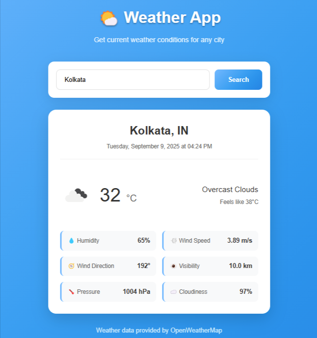

# 🌤️ Weather App


A simple, beginner-friendly weather application that fetches current weather data from OpenWeatherMap API and displays it in a beautiful, responsive interface.

## 📸 Screenshots

<div align="center">
  
  <p><em>Weather App showing current conditions for Kolkata with detailed weather information</em></p>
</div>

## 🚀 Live Demo

[View Live Weather App](https://weather-app-shibam.netlify.app/)

## ✨ Features

- **City Search**: Enter any city name to get current weather information
- **Real-time Data**: Displays temperature, weather description, and weather icon
- **Detailed Information**: Shows humidity, wind speed, wind direction, visibility, pressure, and cloudiness
- **Error Handling**: Proper error messages for invalid cities or network issues
- **Responsive Design**: Works perfectly on desktop, tablet, and mobile devices

## 🚀 Getting Started

### Prerequisites

- A modern web browser
- Internet connection

### Setup Instructions

1. **Download or clone this project**
2. **Open the app**:
   - Simply double-click `index.html` to open it in your default browser
   - OR right-click `index.html` → "Open with" → choose your preferred browser

**That's it!** The app is ready to use with your API key.

## 📁 Project Structure

```
weather-app-shibam/
├── 📄 index.html          # Main HTML structure
├── 🎨 styles.css          # CSS styling and responsive design
├── ⚡ app.js              # JavaScript functionality and API integration
├── 📸 screenshot/         # Project screenshots
│   └── weather-app-shibam.png
├── 📖 README.md          # Project documentation
├── 📜 LICENSE            # MIT License
└── 🚫 .gitignore         # Git ignore rules
```

## 🛠️ Technologies Used

<table>
<tr>
<td align="center"><br><b>HTML5</b></td>
<td align="center"><br><b>CSS3</b></td>
<td align="center"><br><b>JavaScript</b></td>
</tr>
</table>

## 📝 Commit History

This project was developed through 5 key commits:

1. **init** - Initial project setup and basic file structure
2. **layout** - HTML structure and CSS styling implementation
3. **fetch logic** - API integration and weather data fetching functionality
4. **error handling** - Robust error handling for API failures and invalid inputs
5. **docs** - Documentation updates and project finalization

## 🔧 How It Works

1. **User Input**: Enter a city name in the search field
2. **API Request**: The app sends a request to OpenWeatherMap API
3. **Data Processing**: Weather data is fetched and processed
4. **Display**: Information is displayed in a user-friendly format
5. **Error Handling**: Any errors (invalid city, network issues) are handled gracefully

## 🎨 Customization

The app is built with vanilla HTML, CSS, and JavaScript, making it easy to customize:

- **Colors**: Modify the CSS variables in `styles.css`
- **Layout**: Adjust the HTML structure in `index.html`
- **Features**: Add new functionality in `app.js`

## 🌐 API Information

This app uses the [OpenWeatherMap Current Weather Data API](https://openweathermap.org/current):
- **Endpoint**: `https://api.openweathermap.org/data/2.5/weather`
- **Rate Limit**: 1,000 calls/day (free tier)
- **Data**: Temperature, humidity, wind, pressure, visibility, and more

## 🚨 Troubleshooting

**"City not found" error:**
- Check the spelling of the city name
- Try using the format "City, Country" (e.g., "London, UK")

**Network errors:**
- Check your internet connection
- Make sure you're connected to the internet

**If you need to update your API key:**
- Open `app.js` file
- Find line 5: `const API_KEY = 'your_api_key_here';`
- Replace with your own key from [OpenWeatherMap](https://openweathermap.org/api)
- Wait 10-15 minutes for new API keys to activate

## 📱 Browser Support

- Chrome 60+
- Firefox 55+
- Safari 12+
- Edge 79+

## 🤝 Contributing

This is a beginner-friendly project! Feel free to:
- Report bugs
- Suggest new features
- Submit pull requests
- Improve documentation

## 📄 License

This project is licensed under the MIT License - see the [LICENSE](LICENSE) file for details.

---

**Made with ❤️ for learning web development**